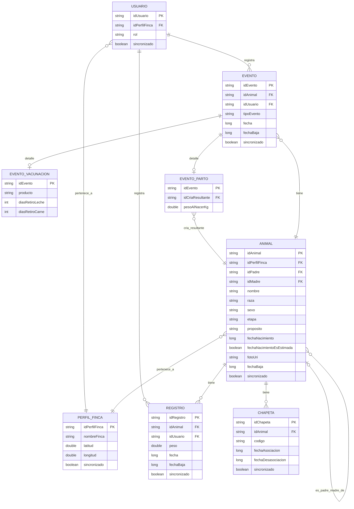

# Diagrama de relaciones — Sistema de trazabilidad bovina

Esquema Room final, con todas las decisiones confirmadas hasta la fecha.

## Notas

- `ANIMAL.idPadre` / `ANIMAL.idMadre`: FK autorreferencial, `onDelete = SET_NULL`.
- `ANIMAL.fechaBaja`, `EVENTO.fechaBaja`, `REGISTRO.fechaBaja`: soft delete (nunca hard-delete), por exigencia de trazabilidad completa de la Ley 1659.
- `EVENTO` es tabla base; `EVENTO_VACUNACION` y `EVENTO_PARTO` son tablas de detalle 1:1 (FK = PK compartida con `EVENTO`). El patrón se extiende igual para otros subtipos (monta, inseminación, desparasitación) cuando se necesiten — no están modelados aún.
- `PERFIL_FINCA` no lleva FK propia hacia `USUARIO` (se decidió que la dirección es `USUARIO → PERFIL_FINCA` y `ANIMAL → PERFIL_FINCA`, no al revés).
